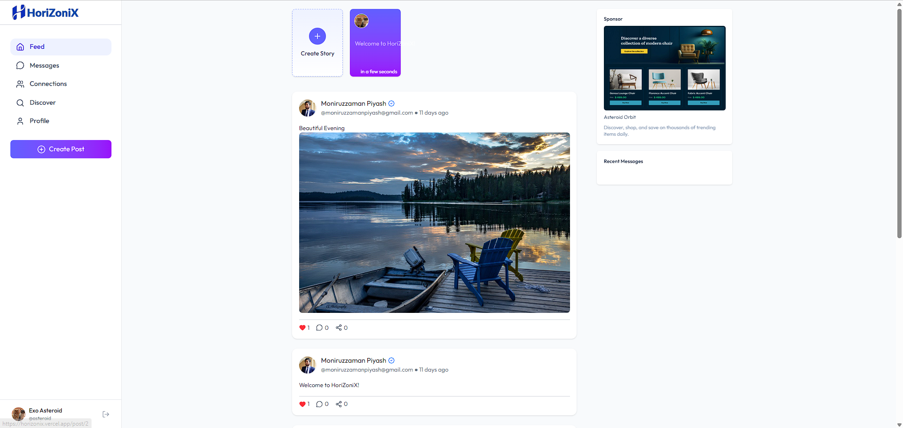

# HoriZonix Frontend

A modern React application built with Vite, featuring a social media platform with real-time chat, posts, and user profiles.

## 🚀 Features

- **Modern React 19** with Vite for fast development
- **Tailwind CSS** for responsive and beautiful UI
- **Real-time Chat** functionality
- **Social Media Posts** with image uploads
- **User Profiles** with customizable avatars
- **Responsive Design** for all devices
- **Hot Module Replacement** for instant updates

## 📸 Showcase

<div align="center">
  
  
</div>

## 🛠️ Tech Stack

- **Frontend Framework**: React 19
- **Build Tool**: Vite 7
- **Styling**: Tailwind CSS 4
- **Routing**: React Router DOM 7
- **HTTP Client**: Axios
- **Icons**: Lucide React
- **Date Handling**: Moment.js
- **Notifications**: React Hot Toast
- **Linting**: ESLint

## 📦 Installation

1. Clone the repository
```bash
git clone https://github.com/Piyash1/HoriZoniX.git
cd HoriZonix
```

2. Install dependencies
```bash
npm install
```

3. Start the development server
```bash
npm run dev
```

## 🚀 Available Scripts

- `npm run dev` - Start development server
- `npm run build` - Build for production
- `npm run preview` - Preview production build
- `npm run lint` - Run ESLint

## 🏗️ Project Structure

```
frontend/
├── public/
│   ├── showcase1.png
│   ├── showcase2.png
│   └── favicon.png
├── src/
│   ├── components/     # Reusable UI components
│   ├── pages/         # Page components
│   ├── lib/           # API utilities
│   └── assets/        # Static assets
├── package.json
└── vite.config.js
```

## 🔧 Development

The project uses Vite for fast development with Hot Module Replacement (HMR). Any changes you make to the source code will be instantly reflected in the browser.

## 📱 Responsive Design

The application is fully responsive and works seamlessly across:
- Desktop computers
- Tablets
- Mobile devices

## 🤝 Contributing

1. Fork the repository
2. Create your feature branch (`git checkout -b feature/AmazingFeature`)
3. Commit your changes (`git commit -m 'Add some AmazingFeature'`)
4. Push to the branch (`git push origin feature/AmazingFeature`)
5. Open a Pull Request

## 📄 License

This project is part of the HoriZonix social media platform.
